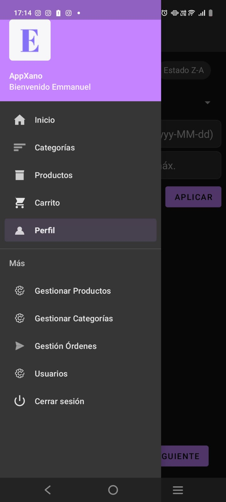
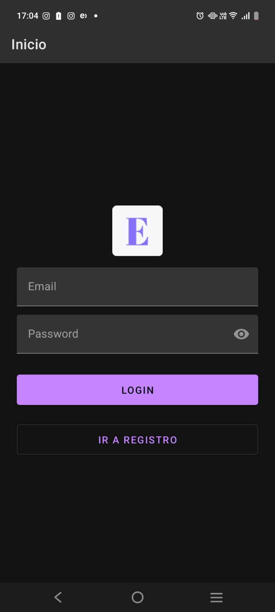
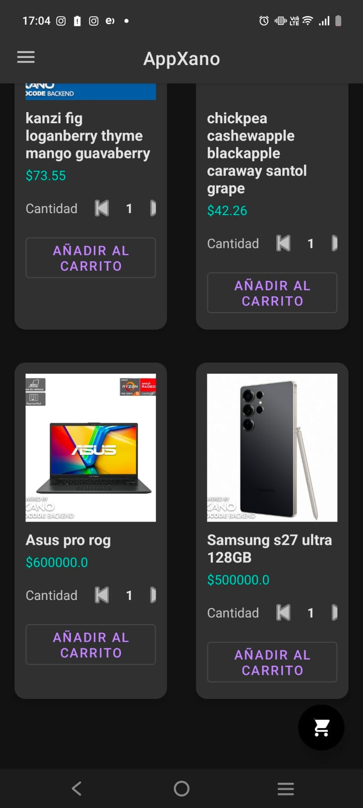
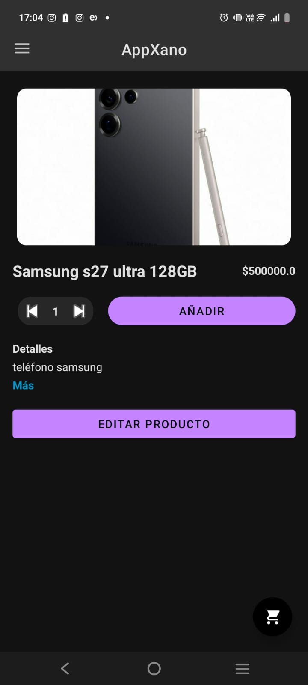
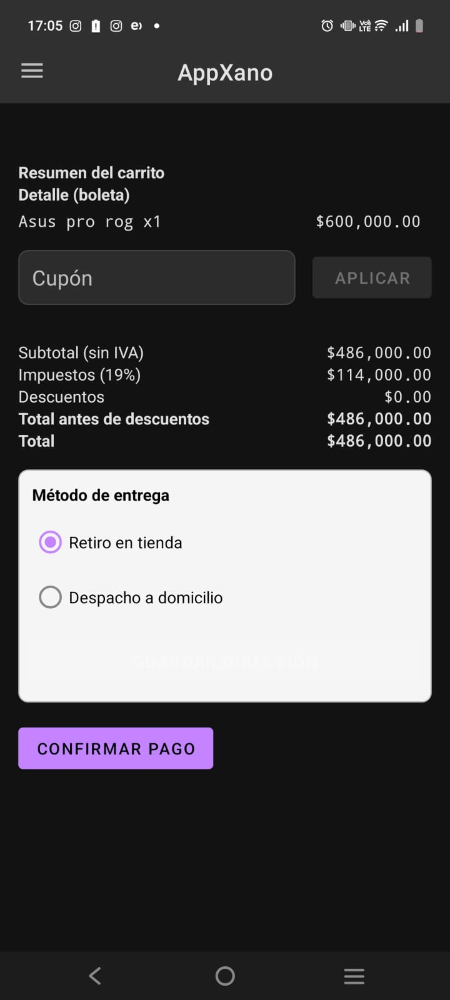
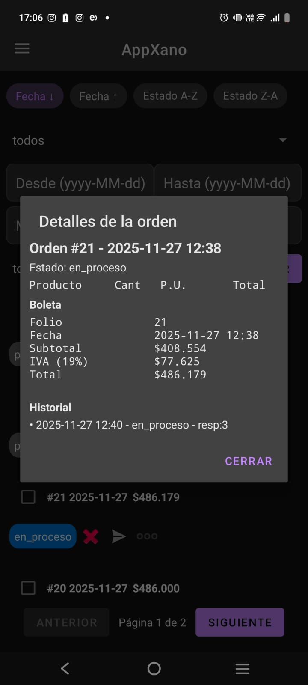

# Proyecto E-commerce Android (Kotlin + Xano)

  

## Descripción

Aplicación nativa de e‑commerce para Android desarrollada en Kotlin, con backend REST en Xano. Ofrece autenticación segura, catálogo de productos, gestión de usuarios y flujo de compra. La configuración de endpoints se gestiona mediante `BuildConfig` y variables definidas en `app/build.gradle.kts`, asegurando despliegues consistentes por ambiente.

## Capturas

<table>
    <tr>
    <td align="center">
      
       menu
    </td>
    <td align="center">
      
       Gestion de ordenes
    </td>
    <td align="center">
      
       Registro
    </td>
  </tr>
  <tr>
    <td align="center">
      
       Login
    </td>
    <td align="center">
      
       Catálogo
    </td>
    <td align="center">
      
       Detalle de producto
    </td>
  </tr>
  <tr>
    <td align="center">
      
       Checkout
    </td>
    <td align="center">
      
       Perfil
    </td>
      <td align="center">
      
       Detalle de orden
    </td>
  </tr>
</table>

## 1. Pasos de Configuración

### Requisitos Previos
- **Android Studio**: Ladybug o superior.
- **JDK**: Java 11 o superior (configurado en Gradle).
- **Dispositivo/Emulador**: Android 7.0 (API 24) o superior.

### Configuración del Proyecto
1.  **Clonar/Abrir**: Abre la carpeta del proyecto en Android Studio.
2.  **Sincronizar Gradle**: Deja que Android Studio descargue las dependencias.
3.  **Verificar `local.properties`**: Asegúrate de que apunte a tu SDK de Android.
4.  **Compilar**: Ejecuta `Build > Make Project` para asegurar que no hay errores de compilación.

### Configuración del Backend (Xano)
El proyecto ya está configurado para apuntar a las siguientes instancias de Xano. No se requiere configuración adicional en el código a menos que cambien los endpoints.

## 2. Variables y URLs del Backend

Las URLs base están definidas en `app/build.gradle.kts` y expuestas vía `BuildConfig`.

| Servicio | Variable | URL Base | Swagger |
| :--- | :--- | :--- | :--- |
| **Authentication** | `AUTH_BASE_URL` | `https://x8ki-letl-twmt.n7.xano.io/api:E0E2xd7q/` | `https://x8ki-letl-twmt.n7.xano.io/api:E0E2xd7q` |
| **Ecommerce API** | `STORE_BASE_URL` | `https://x8ki-letl-twmt.n7.xano.io/api:-51vSSC_/` | `https://x8ki-letl-twmt.n7.xano.io/api:-51vSSC_` |
| **Members & Accounts** | `USER_BASE_URL` | `https://x8ki-letl-twmt.n7.xano.io/api:Az9iOmEB/` | `https://x8ki-letl-twmt.n7.xano.io/api:Az9iOmEB?token=PUiLFcwB9eZUepGZFzUyY7O3MAs` |

> **Nota**: El endpoint de usuarios (`/user`) requiere un token de autenticación válido obtenido a través del servicio de Autenticación.

## 3. Usuarios de Prueba

Utiliza estas credenciales para probar los diferentes roles en la aplicación:

### Administrador
- **Email**: `emm.moreno@duocuc.cl`
- **Password**: `Brilin1*`
- **Capacidades**: Gestión de usuarios, ver todas las órdenes, editar productos.

### Cliente (Usuario)
- **Email**: `usuario@duocuc.cl`
- **Password**: `Brilin1*`
- **Capacidades**: Comprar productos, ver historial de órdenes propias, editar perfil propio.

## 4. Almacenamiento de Imágenes

Las imágenes de los productos y avatares se almacenan directamente en **Xano**.

- **Subida**: Se utiliza el endpoint `POST /upload/image` (definido en `UploadService`).
- **Formato**: Las imágenes se envían como `multipart/form-data`.
- **Respuesta**: Xano devuelve un objeto con la URL pública de la imagen, que luego se guarda en el registro del producto o usuario.

## Lógica de Usuarios Bloqueados

- Estados del usuario: el backend expone `status` (`active`, `inactive`, `disconnected`, `blocked`) y un flag `blocked` que puede reflejar el estado real (`app/src/main/java/com/example/myapplication/model/User.kt:12-16`).
- Bloqueo en inicio de sesión: si el usuario autenticado tiene `status = "blocked"`, se limpia el token y no se permite el ingreso (`app/src/main/java/com/example/myapplication/ui/MainActivity.kt:47-55`, `app/src/main/java/com/example/myapplication/ui/MainActivity.kt:114-119`).
- Administración del bloqueo: un administrador puede cambiar el estado del usuario a `blocked`/`active` desde la lista de usuarios; se llama al endpoint de miembros y se actualiza la UI de forma optimista (`app/src/main/java/com/example/myapplication/ui/UsersFragment.kt:301-318`, `app/src/main/java/com/example/myapplication/ui/UsersAdapter.kt:69-75`, `app/src/main/java/com/example/myapplication/ui/UsersAdapter.kt:81-88`).
- Listado y filtros: el servicio soporta filtros por `blocked` y `status` para paginar/buscar usuarios (`app/src/main/java/com/example/myapplication/api/UserService.kt:13-30`).

## Lógica de Órdenes

- Creación en checkout: la orden se crea al finalizar el checkout usando `CheckoutRequest`; el estado inicial actual en código es `pendiente` (`app/src/main/java/com/example/myapplication/model/CreateOrderRequest.kt:18-21`) y puede transicionar a `en_proceso`/`completada`/`cancelada` vía acciones de administrador (`app/src/main/java/com/example/myapplication/ui/OrdersAdapter.kt:103-118`, `app/src/main/java/com/example/myapplication/ui/OrdersAdapter.kt:128-135`).
- Visualización inicial: el usuario ve sus órdenes en la lista; el detalle se enriquece cuando la orden deja de estar `pendiente` (se muestra “Boleta” e importes con IVA) (`app/src/main/java/com/example/myapplication/ui/OrdersFragment.kt:374-394`).
- Historial de estados: cada cambio de estado agrega un registro con timestamp, responsable y comentario opcional; se guarda localmente y se muestra en el diálogo de detalles (`app/src/main/java/com/example/myapplication/ui/OrdersFragment.kt:124-131`, `app/src/main/java/com/example/myapplication/ui/OrdersFragment.kt:499-509`, `app/src/main/java/com/example/myapplication/ui/OrdersFragment.kt:512-518`).
- Restricciones por rol: clientes solo ven sus propias órdenes; admins pueden filtrar, ordenar y aplicar cambios masivos de estado (`app/src/main/java/com/example/myapplication/ui/OrdersFragment.kt:85-93`, `app/src/main/java/com/example/myapplication/ui/OrdersFragment.kt:213-217`, `app/src/main/java/com/example/myapplication/ui/OrdersFragment.kt:453-477`).
- Estados soportados: `pendiente`, `confirmada`, `en_proceso`, `enviado`, `aceptado`, `rechazado`, `completada`, `cancelada` (`app/src/main/java/com/example/myapplication/ui/OrdersFragment.kt:154-159`).

## Otra lógica relevante

- Generación de “Boleta”: cálculo de subtotal e IVA (19%) y presentación cuando la orden no está `pendiente` (`app/src/main/java/com/example/myapplication/ui/OrdersFragment.kt:374-394`).
- Acciones contextuales: los botones disponibles dependen del estado actual de la orden; por ejemplo, `pendiente → en_proceso`, `en_proceso → completada`, y cancelación permitida en `pendiente`/`en_proceso` (`app/src/main/java/com/example/myapplication/ui/OrdersAdapter.kt:128-135`).
- Auditoría de cancelación: al cancelar se registra motivo, admin y timestamp, y se añade al historial (`app/src/main/java/com/example/myapplication/ui/OrdersFragment.kt:417-446`).
